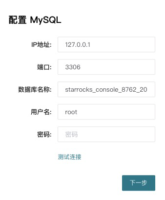

# 部署 StarRocks 集群

本文介绍如何部署 StarRocks 集群。

您可以通过命令行手动部署 StarRocks 集群，或使用 StarRocksManager 自动部署。命令行部署的方式适用于希望使用自有系统运维 StarRocks 集群的用户，有助于集群管理员直接定位并处理一些较复杂的问题。在自动部署模式中，您只需要在 StarRocksManager 页面上进行简单的配置、选择、输入操作后即可批量完成，并且该模式包含 Supervisor 进程管理、滚动升级、备份、回滚等运维功能。

> StarRocksManager 为企业版功能，如需试用，请至 [StarRocks 官网](https://www.starrocks.com/zh-CN/download) 页面下方点击「现在咨询」获取。

## 通过命令行手动部署

手动部署 StarRocks 集群的详细操作，请参考 [手动部署 StarRocks](../quick_start/Deploy.md)。

### 部署 FE 高可用集群

FE 的高可用集群采用主从复制架构，可避免 FE 单点故障。FE 采用了类 Raft 的 Berkeley DB Java Edition（BDBJE）协议完成选主，日志复制和故障切换。在 FE 集群中，多实例分为两种角色：Follower 和 Observer。前者为复制协议的可投票成员，参与选主和提交日志，一般数量为奇数（2n+1），使用多数派（n+1）确认，可容忍少数派（n）故障；后者属于非投票成员，用于异步订阅复制日志，Observer 的状态落后于 Follower，类似其他复制协议中的 Learner 角色。

FE 集群从 Follower 中自动选出 Master 节点，所有更改状态操作都由 Master 节点执行。最新状态可以从 FE Master 节点读取。更改操作可以由非 Master 节点发起，继而转发给 Master 节点执行，非 Master 节点在复制日志中的 LSN 记录最近一次更改操作。读操作可以直接在非 Master 节点上执行，但需要等待非 Master 节点的状态已经同步到最近一次更改操作的 LSN，因此非 Master 节点的读写操作满足顺序一致性。Observer 节点能够增加 FE 集群的读负载能力，对时效性要求放宽的非紧要用户可以选择读 Observer 节点。

> 注意
>
> * FE 节点之间的时钟相差**不能超过5s**。如果节点之间存在较大时钟差，请使用 NTP 协议校准时间。
> * 一台机器上只可以部署单个 FE 节点。
> * 所有 FE 节点的 `http_port` 需保持相同。

#### 下载并配置新 FE 节点

详细操作请参考 [手动部署 StarRocks FE 节点](../quick_start/Deploy.md#部署-FE-节点)。

#### 添加新 FE 节点

使用 MySQL 客户端连接已有 FE 节点，添加新 FE 节点的信息，包括角色、IP 地址、以及 Port。

* 添加 FE Follower 节点。

```sql
ALTER SYSTEM ADD FOLLOWER "host:port";
```

* 添加 FE Observer 节点。

```sql
ALTER SYSTEM ADD OBSERVER "host:port";
```

* `host`：机器的IP 地址。如果机器存在多个 IP 地址，则该项为 `priority_networks` 设置项下设定的唯一通信 IP 地址。
* `port`：`edit_log_port` 设置项下设定的端口，默认为 `9010`。

出于安全考虑，StarRocks 的 FE 节点和 BE 节点只会监听一个 IP 地址进行通信。如果一台机器有多块网卡，StarRocks 有可能无法自动找到正确的 IP 地址。例如，通过 `ifconfig` 命令查看到 `eth0` IP 地址为 `192.168.1.1`，`docker0` IP 地址为 `172.17.0.1`，您可以设置 `192.168.1.0/24` 子网以指定使用 `eth0` 作为通信 IP。此处采用 [CIDR](https://en.wikipedia.org/wiki/Classless_Inter-Domain_Routing) 的表示方法来指定 IP 所在子网范围，以便在所有的 BE 及 FE 节点上使用相同的配置。

如出现错误，您可以通过命令删除相应 FE 节点。

* 删除 FE Follower 节点。

```sql
ALTER SYSTEM DROP FOLLOWER "host:port";
```

* 删除 FE Observer 节点。

```sql
ALTER SYSTEM drop OBSERVER "host:port";
```

具体操作参考[扩容缩容](../administration/Scale_up_down.md)。

#### 连接 FE 节点

FE 节点需两两之间建立通信连接方可实现复制协议选主，投票，日志提交和复制等功能。当的新FE节点**首次**被添加到已有集群并启动时，您需要指定集群中现有的一个节点作为 helper 节点，并从该节点获得集群的所有 FE 节点的配置信息，才能建立通信连接。因此，在首次启动新 FE 节点时候，您需要通过命令行指定 `--helper` 参数。

```shell
./bin/start_fe.sh --helper host:port --daemon
```

* `host`：机器的IP 地址。如果机器存在多个 IP 地址，则该项为 `priority_networks` 设置项下设定的唯一通信 IP 地址。
* `port`：`edit_log_port` 设置项下设定的端口，默认为 `9010`。

#### 确认 FE 集群部署成功

查看集群状态，确认部署成功。

```sql
SHOW PROC '/frontends'\G
```

以下示例中，`172.26.108.172_9010_1584965098874` 为主 FE 节点。

```Plain Text
mysql> SHOW PROC '/frontends'\G

********************* 1. row **********************
    Name: 172.26.108.172_9010_1584965098874
      IP: 172.26.108.172
HostName: starrocks-sandbox01
......
    Role: FOLLOWER
IsMaster: true
......
   Alive: true
......
********************* 2. row **********************
    Name: 172.26.108.174_9010_1584965098874
      IP: 172.26.108.174
HostName: starrocks-sandbox02
......
    Role: FOLLOWER
IsMaster: false
......
   Alive: true
......
********************* 3. row **********************
    Name: 172.26.108.175_9010_1584965098874
      IP: 172.26.108.175
HostName: starrocks-sandbox03
......
    Role: FOLLOWER
IsMaster: false
......
   Alive: true
......
3 rows in set (0.05 sec)
```

节点的 `Alive` 项为 `true` 时，添加节点成功。

## 通过 StarRocksManager 自动部署

如果您是 StarRocks 企业版用户，你可以通过 StarRocksManager 自动部署 StarRocks 集群。

### 安装依赖

您需要在所有拟部署 StarRocks 的节点上安装以下依赖:

|依赖|说明|
|----|----|
|JDK（1.8 或以上）|下载完成后，您需要在 FE 节点配置文件 **fe.conf** 中的 `JAVA_HOME` 配置项下指定 JDK 的安装路径。|
|Python（2.7 或以上）| |
|python-setuptools|您可以通过 `yum install setuptools` 或 `apt-get install setuptools` 安装。|
|MySQL（5.5 或以上）|您需要通过 MySQL 存储 StarRocksManager 平台的数据。|

### 安装 StarRocksManager 部署工具

下载并解压 StarRocksManager 安装包。

解压完成后，安装 StarRocksManager。

```shell
bin/install.sh -h \
-d /home/disk1/starrocks/starrocks-manager-20200101 \
-y  /usr/bin/python -p 19321 -s 19320
```

* `-d`：StarRocksManager 的安装路径。
* `-y`：Python 路径。
* `-p`：`admin_console_port`，默认为 `19321`。
* `-s`：`supervisor_http_port`，默认为 `19320`。

### 安装部署 StarRocks

完成安装 StarRocksManager 后，您可以在 Web 页面中安装部署 StarRocks。

#### 配置 MySQL 数据库

首先，您需要配置一个安装好的 MySQL 数据库，用于存储 StarRocksManager 的管理、查询、报警等信息。



#### 配置节点信息

添加需要部署的节点，并配置 Agent 和 Supervisor 安装目录和端口，Python 路径以及其他信息。

> 说明：Agent 负责采集机器的统计信息，Supervisor 管理进程的启动与停止。两者均安装在用户环境，不会影响系统环境。


#### 安装 FE 节点

配置 FE 节点相关信息。端口的含义参考下方[端口列表](#端口列表)。

建议您配置 1 或者 3 个 FE Follower。如果请求压力较大，建议您酌情增加 FE Observer 数量。


`Meta Dir`：StarRocks 的元数据目录。建议您配置独立的 **starrocks-meta** 和 FE 的 log 目录。

#### 安装 BE 节点

配置 FE 节点相关信息。端口的含义参考下方[端口列表](#端口列表)。


#### 安装 Broker

建议您在所有节点上安装 Broker。端口的含义参考下方[端口列表](#端口列表)。


#### 安装中心服务

配置中心服务以及邮件服务的相关信息。

中心服务负责从 Agent 拉取并汇总信息后存储在 MySQL 中，并提供监控报警的服务。此处邮件服务是指通过邮箱接收报警通知。邮件服务可以稍后配置。


#### 端口列表

|实例名称|端口名称|默认端口|通讯方向|说明|
|---|---|---|---|---|
|BE|be_port|9060|FE&nbsp;&nbsp; --> BE|BE 上 thrift server 的端口，<br/>用于接收来自 FE 的请求。|
|BE|webserver_port|8040|BE <--> BE|BE 上的 http server 的端口。|
|BE|heartbeat_service_port|9050|FE&nbsp;&nbsp; --> BE|BE 上心跳服务端口（thrift），<br/>用于接收来自 FE 的心跳。|
|BE|brpc_port|8060|FE <--> BE<br/>BE <--> BE|BE 上的 brpc 端口，<br/>用于 BE 之间通讯。|
|FE|**http_port**|**8030**|FE <--> 用户|FE 上的 http server 端口。|
|FE|rpc_port|9020|BE&nbsp;&nbsp; --> FE<br/> FE <--> FE|FE 上的 thrift server 端口。|
|FE|**query_port**|**9030**| FE <--> 用户|FE 上的 mysql server 端口。|
|FE|edit_log_port|9010|FE <--> FE|FE 上的 BDBJE 之间通信端口。|
|Broker|broker_ipc_port|8000|FE&nbsp;&nbsp; --> Broker <br/>BE&nbsp;&nbsp; --> Broker|Broker 上的 thrift server，<br/>用于接收请求。|

其中 http_port(8030)、query_port(9030) 是常用端口，前者用于网页访问 FE，后者用于 MySQL 客户端访问。

### FAQ

Q：如何设置 `ulimit`？
A：您可以通过在**所有机器**上运行 `ulimit -n 65536` 命令设置。如果系统提示您“没有权限”，请尝试以下方案：
  
首先，请在 **/etc/security/limits.conf** 添加如下配置：
  
```Plain Text
# 4个元素，具体可以参考 limits.conf 中的说明，*代表所有用户。
* soft nofile 65535
* hard nofile 65535
```
  
然后，请在 **/etc/pam.d/login** 和 **/etc/pam.d/sshd** 中添加如下配置：
  
```Plain Text
session  required  pam_limits.so
```
  
最后，请确认 **/etc/ssh/sshd_config** 中存在 **UsePAM yes**。如果没有，请添加该参数，并运行 `restart sshd`。

Q：安装 Python 时遇到问题 `__init__() takes 2 arguments (4 given)`，如何处理？
A：如果在安装 Python 时遇到问题 `__init__() takes 2 arguments (4 given)`，请执行如下步骤：

首先，请运行 `which python` 命令确认 Python 安装路径为 **/usr/bin/python**。
然后，请删除 python-setuptools 安装包：

```shell
yum remove python-setuptools
```

接下来，请删除 setuptool 相关文件。

```shell
rm /usr/lib/python2.7/site-packages/setuptool* -rf
```

最后，您需要获取 **ez_setup.py** 文件。

```shell
wget https://bootstrap.pypa.io/ez_setup.py -O - | python
```

## 下一步

成功部署 StarRocks 集群后，您可以：

* [创建表](Create_table.md)
* [导入和查询数据](Import_and_query.md)
