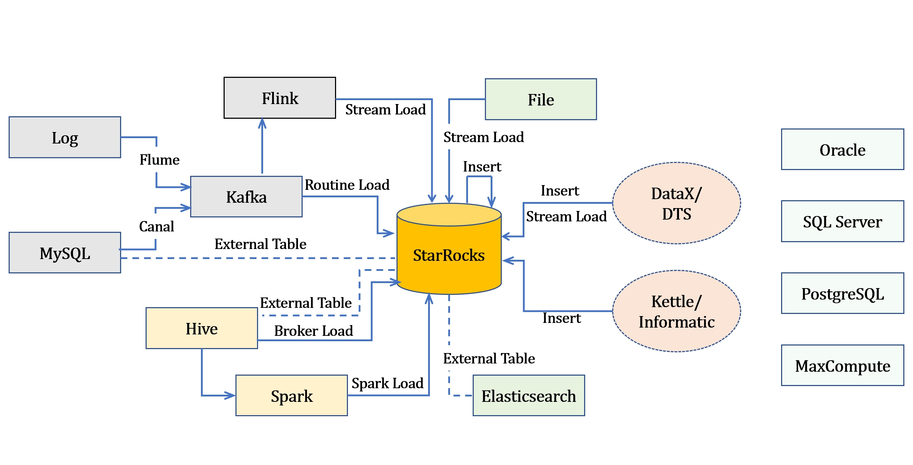

# 导入

为了更好地满足各种不同的业务场景，StarRocks 支持多种数据模型，StarRocks 中存储的数据需要按照特定的模型进行组织（参考 [表设计](../table_design/Table_design.md) 章节）。数据导入功能是将原始数据按照相应的模型进行清洗转换并加载到 StarRocks 中，方便查询使用。

StarRocks 提供了多种导入方式，用户可以根据数据量大小、导入频率等要求选择最适合自己业务需求的导入方式。本节介绍数据导入的基本概念、基本原理、系统配置、不同导入方式的适用场景，以及一些最佳实践案例和常见问题。

> 注意：建议先完整阅读本节，再根据所选导入方式查看详细内容。

根据不同的数据来源可以选择不同的导入方式：

* 离线数据导入，如果数据源是 Hive/HDFS，推荐采用 [Broker Load 导入](BrokerLoad.md),  如果数据表很多导入比较麻烦可以考虑使用 [Hive 外表](../using_starrocks/External_table.md) 直连查询，性能会比 Broker load 导入效果差，但是可以避免数据搬迁，如果单表的数据量特别大，或者需要做全局数据字典来精确去重可以考虑 [Spark Load 导入](../loading/SparkLoad.md)。
* 实时数据导入，日志数据和业务数据库的 binlog 同步到 Kafka 以后，优先推荐通过 [Routine load](RoutineLoad.md) 导入 StarRocks，如果导入过程中有复杂的多表关联和 ETL 预处理可以使用 Flink 处理以后用 stream load 写入 StarRocks，我们有标准的 [Flink-connector](Flink-starrocks-connector.md) 可以方便 Flink 任务使用。
* 程序写入 StarRocks，推荐使用 [Stream Load](StreamLoad.md)，可以参考 [例子](https://github.com/StarRocks/demo/tree/master/MiscDemo/stream_load) 中有 Java/Python 的 demo。
* 文本文件导入推荐使用 Stream load
* Mysql 数据导入，推荐使用 [Mysql 外表](../using_starrocks/External_table.md)，insert into new_table select * from external\_table 的方式导入
* 其他数据源导入，推荐使用 DataX 导入，我们提供了 [DataX-starrocks-writer](DataX-starrocks-writer.md)
* StarRocks 内部导入，可以在 StarRocks 内部使用 [insert into tablename select](InsertInto.md) 的方式导入，可以跟外部调度器配合实现简单的 ETL 处理。

## 名词解释

* **导入作业**：导入作业读取用户提交的源数据并进行清洗转换后，将数据导入到 StarRocks 系统中。导入完成后，数据即可被用户查询到。
* **Label**：所有导入作业都有一个 Label，用于标识一个导入作业。Label 可由用户指定或系统自动生成。Label 在一个数据库内是唯一的，一个 Label 仅可用于一个成功的导入作业。当一个 Label 对应的导入作业成功后，不可再重复使用该 Label 提交导入作业。如果某 Label 对应的导入作业失败，则该 Label 可以被再使用。该机制可以保证 Label 对应的数据最多被导入一次，即 At-Most-Once 语义。
* **原子性**：StarRocks 中所有导入方式都提供原子性保证，即同一个导入作业内的所有有效数据要么全部生效，要么全部不生效，不会出现仅导入部分数据的情况。这里的有效数据不包括由于类型转换错误等数据质量问题而被过滤的数据。具体见常见问题小节里所列出的数据质量问题。
* **MySQL 协议/HTTP 协议**：StarRocks 提供两种访问协议接口：MySQL 协议和 HTTP 协议。部分导入方式使用 MySQL 协议接口提交作业，部分导入方式使用 HTTP 协议接口提交作业。
* **Broker Load**：Broker 导入，即通过部署的 Broker 程序读取外部数据源（如 HDFS）中的数据，并导入到 StarRocks。Broker 进程利用自身的计算资源对数据进行预处理导入。
* **Spark Load**：Spark 导入，即通过外部资源如 Spark 对数据进行预处理生成中间文件，StarRocks 读取中间文件导入。这是一种异步的导入方式，用户需要通过 MySQL 协议创建导入，并通过查看导入命令检查导入结果。
* **FE**：Frontend，StarRocks 系统的元数据和调度节点。在导入流程中主要负责导入执行计划的生成和导入任务的调度工作。
* **BE**：Backend，StarRocks 系统的计算和存储节点。在导入流程中主要负责数据的 ETL 和存储。
* **Tablet**：StarRocks 表的逻辑分片，一个表按照分区、分桶规则可以划分为多个分片（参考 [数据分布](../table_design/Data_distribution.md) 章节）。

## 基本原理

导入执行流程：

  
一个导入作业主要分为 5 个阶段：

1.**PENDING**

非必须。该阶段是指用户提交导入作业后，等待 FE 调度执行。

Broker Load 和 Spark Load 包括该步骤。

2.**ETL**

非必须。该阶段执行数据的预处理，包括清洗、分区、排序、聚合等。

Spark Load 包括该步骤，它使用外部计算资源 Spark 完成 ETL。

3.**LOADING**

该阶段先对数据进行清洗和转换，然后将数据发送给 BE 处理。当数据全部导入后，进入等待生效过程，此时导入作业状态依旧是 LOADING。

4.**FINISHED**

在导入作业涉及的所有数据均生效后，作业的状态变成 FINISHED，FINISHED 后导入的数据均可查询。FINISHED 是导入作业的最终状态。

5.**CANCELLED**

在导入作业状态变为 FINISHED 之前，作业随时可能被取消并进入 CANCELLED 状态，如用户手动取消或导入出现错误等。CANCELLED 也是导入作业的一种最终状态。

**数据导入格式：**

* 整型类（TINYINT，SMALLINT，INT，BIGINT，LARGEINT）：1, 1000, 1234
* 浮点类（FLOAT，DOUBLE，DECIMAL）：1.1, 0.23, .356
* 日期类（DATE，DATETIME）：2017-10-03, 2017-06-13 12:34:03
* 字符串类（CHAR，VARCHAR）：I am a student, a
* NULL 值：\\N

## 导入方式

### 导入方式介绍

为适配不同的数据导入需求，StarRocks 系统提供了 5 种不同的导入方式，以支持不同的数据源（如 HDFS、Kafka、本地文件等），或者按不同的方式（异步或同步）导入数据。

所有导入方式都支持 CSV 数据格式。其中 Broker Load 还支持 Parquet 和 ORC 数据格式。

1.**Broker Load**

Broker Load 通过 Broker 进程访问并读取外部数据源，然后采用 MySQL 协议向 StarRocks 创建导入作业。提交的作业将异步执行，用户可通过 `SHOW LOAD` 命令查看导入结果。

Broker Load 适用于源数据在 Broker 进程可访问的存储系统（如 HDFS）中，数据量为几十 GB 到上百 GB。

2.**Spark Load**

Spark Load 通过外部的 Spark 资源实现对导入数据的预处理，提高 StarRocks 大数据量的导入性能并且节省 StarRocks 集群的计算资源。Spark load 是一种异步导入方式，需要通过 MySQL 协议创建导入作业，并通过 `SHOW LOAD` 查看导入结果。

Spark Load 适用于初次迁移大数据量（可到 TB 级别）到 StarRocks 的场景，且源数据在 Spark 可访问的存储系统（如 HDFS）中。

3.**Stream Load**

Stream Load 是一种同步执行的导入方式。用户通过 HTTP 协议发送请求将本地文件或数据流导入到 StarRocks 中，并等待系统返回导入的结果状态，从而判断导入是否成功。

Stream Load 适用于导入本地文件，或通过程序导入数据流中的数据。

4.**Routine Load**

Routine Load（例行导入）提供了一种自动从指定数据源进行数据导入的功能。用户通过 MySQL 协议提交例行导入作业，生成一个常驻线程，不间断的从数据源（如 Kafka）中读取数据并导入到 StarRocks 中。

5.**Insert Into**

类似 MySQL 中的 Insert 语句，StarRocks 提供 INSERT INTO tbl SELECT ...; 的方式从 StarRocks 的表中读取数据并导入到另一张表。或者通过 INSERT INTO tbl VALUES(...); 插入单条数据。

### 同步和异步

StarRocks 目前的导入方式分为两种：同步和异步。

> 注意：如果是外部程序接入 StarRocks 的导入功能，需要先判断使用导入方式是哪类，然后再确定接入逻辑。

#### **同步导入**

同步导入方式即用户创建导入任务，StarRocks 同步执行，执行完成后返回导入结果。用户可通过该结果判断导入是否成功。

同步类型的导入方式有：Stream Load，Insert。

**操作步骤：**

* 用户（外部系统）创建导入任务。
* StarRocks 返回导入结果。
* 用户（外部系统）判断导入结果。如果导入结果为失败，可以再次创建导入任务。

#### **异步导入**

异步导入方式即用户创建导入任务后，StarRocks 直接返回创建成功。创建成功不代表数据已经导入成功。导入任务会被异步执行，用户在创建成功后，需要通过轮询的方式发送查看命令查看导入作业的状态。如果创建失败，则可以根据失败信息，判断是否需要再次创建。

异步类型的导入方式有：Broker Load, Spark Load。

**操作步骤**：

* 用户（外部系统）创建导入任务；
* StarRocks 返回创建任务的结果；
* 用户（外部系统）判断创建任务的结果，如果成功则进入步骤 4；如果失败则可以回到步骤 1，重新尝试创建导入任务；
* 用户（外部系统）轮询查看任务状态，直到状态变为 FINISHED 或 CANCELLED。

### 适用场景

1. **HDFS 导入**

    源数据存储在 HDFS 中，数据量为几十 GB 到上百 GB 时，可采用 Broker Load 方法向 StarRocks 导入数据。此时要求部署的 Broker 进程可以访问 HDFS 数据源。导入数据的作业异步执行，用户可通过 `SHOW LOAD` 命令查看导入结果。

    源数据存储在 HDSF 中，数据量达到 TB 级别时，可采用 Spark Load 方法向 StarRocks 导入数据。此时要求部署的 Spark 进程可以访问 HDFS 数据源。导入数据的作业异步执行，用户可通过 `SHOW LOAD` 命令查看导入结果。

    对于其它外部数据源，只要 Broker 或 Spark 进程能读取对应数据源，也可采用 Broker Load 或 Spark Load 方法导入数据。

2. **本地文件导入**

    数据存储在本地文件中，数据量小于 10GB，可采用 Stream Load 方法将数据快速导入 StarRocks 系统。采用 HTTP 协议创建导入作业，作业同步执行，用户可通过 HTTP 请求的返回值判断导入是否成功。

3. **Kafka 导入**

    数据来自于 Kafka 等流式数据源，需要向 StarRocks 系统导入实时数据时，可采用 Routine Load 方法。用户通过 MySQL 协议创建例行导入作业，StarRocks 持续不断地从 Kafka 中读取并导入数据。

4. **Insert Into 导入**

    手工测试及临时数据处理时可以使用 `Insert Into` 方法向 StarRocks 表中写入数据。其中，`INSERT INTO tbl SELECT ...;` 语句是从 StarRocks 的表中读取数据并导入到另一张表；`INSERT INTO tbl VALUES(...);` 语句向指定表里插入单条数据。

## 内存限制

用户可以通过设置参数来限制单个导入作业的内存使用，以防止导入占用过多的内存而导致系统 OOM。 不同导入方式限制内存的方式略有不同，具体可参阅各导入方式的详细介绍章节。

一个导入作业通常会分布在多个 BE 上执行，内存参数限制的是一个导入作业在单个 BE 上的内存使用，而不是在整个集群的内存使用。

同时，每个 BE 会设置可用于导入作业的内存总上限。具体配置参阅“4.1.5 通用系统配置”小节。这个配置限制了所有在该 BE 上运行的导入任务的总体内存使用上限。

较小的内存限制可能会影响导入效率，因为导入流程可能会因为内存达到上限而频繁的将内存中的数据写回磁盘。而过大的内存限制可能导致当导入并发较高时系统 OOM。所以需要根据需求合理地设置内存参数。

## 通用系统配置

本节解释对所有导入方式均可用的系统配置。

### **FE 配置**

以下配置属于 FE 的系统配置，可以通过修改 FE 的配置文件 fe.conf 来修改：

* max\_load\_timeout\_second 和 min\_load\_timeout\_second

    设置导入超时时间的最大、最小取值范围，均以秒为单位。默认的最大超时时间为 3 天，最小超时时间为 1 秒。用户自定义的导入超时时间不可超过这个范围。该参数通用于所有类型的导入任务。

* desired\_max\_waiting\_jobs

    等待队列可以容纳的最多导入任务数目，默认值为 100。如 FE 中处于 PENDING 状态（即等待执行）的导入任务数目达到该值，则新的导入请求会被拒绝。此配置仅对异步执行的导入有效，如处于等待状态的异步导入任务数达到限额，则后续创建导入的请求会被拒绝。

* max\_running\_txn\_num\_per\_db

    每个数据库中正在运行的导入任务的最大个数（不区分导入类型、统一计数），默认值为 100。当数据库中正在运行的导入任务超过最大值时，后续的导入不会被执行。如果是同步作业，则作业会被拒绝；如果是异步作业，则作业会在队列中等待。

* label\_keep\_max\_second

    导入任务记录的保留时间。已经完成的（ FINISHED or CANCELLED ）导入任务记录会在 StarRocks 系统中保留一段时间，时间长短则由此参数决定。参数默认值时间为 3 天。该参数通用于所有类型的导入任务。

### **BE 配置**

以下配置属于 BE 的系统配置，可以通过修改 BE 的配置文件 be.conf 来修改：

* push\_write\_mbytes\_per\_sec

    BE 上单个 Tablet 的写入速度限制。默认是 10，即 10MB/s。根据 Schema 以及系统的不同，通常 BE 对单个 Tablet 的最大写入速度大约在 10-30MB/s 之间。可以适当调整这个参数来控制导入速度。

* write\_buffer\_size

    导入数据在 BE 上会先写入到一个内存块，当这个内存块达到阈值后才会写回磁盘。默认大小是 100MB。过小的阈值可能导致 BE 上存在大量的小文件。可以适当提高这个阈值减少文件数量。但过大的阈值可能导致 RPC 超时，见下面的配置说明。

* tablet\_writer\_rpc\_timeout\_sec

    导入过程中，发送一个 Batch（1024 行）的 RPC 超时时间。默认为 600 秒。因为该 RPC 可能涉及多个分片内存块的写盘操作，所以可能会因为写盘导致 RPC 超时，可以适当调整这个超时时间来减少超时错误（如 send batch fail 错误）。同时，如果调大 write\_buffer\_size 配置，也需要适当调大这个参数。

* streaming\_load\_rpc\_max\_alive\_time\_sec

    在导入过程中，StarRocks 会为每个 Tablet 开启一个 Writer，用于接收数据并写入。这个参数指定了 Writer 的等待超时时间。默认为 600 秒。如果在参数指定时间内 Writer 没有收到任何数据，则 Writer 会被自动销毁。当系统处理速度较慢时，Writer 可能长时间接收不到下一批数据，导致导入报错：TabletWriter add batch with unknown id。此时可适当增大这个配置。

* load\_process\_max\_memory\_limit\_bytes 和 load\_process\_max\_memory\_limit\_percent

    这两个参数分别是最大内存和最大内存百分比，限制了单个 BE 上可用于导入任务的内存上限。系统会在两个参数中取较小者，作为最终的 BE 导入任务内存使用上限。

  * load\_process\_max\_memory\_limit\_percent：表示对 BE 总内存限制的百分比。默认为 30。（总内存限制 mem\_limit 默认为 80%，表示对物理内存的百分比）。即假设物理内存为 M，则默认导入内存限制为 M \* 80% \* 30%。
  
  * load\_process\_max\_memory\_limit\_bytes：默认为 100GB。

## 注意事项

用户在向 StarRocks 导入数据时，一般会采用程序对接的方式。以下是导入数据时的一些注意事项：

1. 选择合适的导入方式：根据数据量大小、导入频次、数据源所在位置选择导入方式。例如：如果原始数据存放在 HDFS 上，则使用 Broker load 导入。
2. 确定导入方式的协议：如果选择了 Broker Load 导入方式，则外部系统需要能使用 MySQL 协议定期提交和查看导入作业。
3. 确定导入方式的类型：导入方式分为同步或异步。如果是异步导入方式，外部系统在提交创建导入后，必须调用查看导入命令，根据查看导入命令的结果来判断导入是否成功。
4. 制定 Label 生成策略：Label 生成策略需满足对每一批次数据唯一且固定的原则。
5. 保证 Exactly-Once：外部系统需要保证数据导入的 At-Least-Once，StarRocks 的 Label 机制可以保证数据导入的 At-Most-Once。这样整体上就可以保证数据导入的 Exactly-Once。

## 常见问题

### **Label Already Exists**

同一个数据库内已经有一个相同 Label 的导入作业导入成功或者正在执行。需要检查不同导入方式之间是否有 Label 冲突，或者是任务重复提交了。Label 重复排查步骤如下：

* 由于 StarRocks 系统中导入的 Label 不区分导入方式，所以存在其他导入方式使用了相同 Label 的问题。
* 通过 SHOW LOAD WHERE LABEL = “xxx”，其中 xxx 为待检查的 Label 字符串，查看是否已经存在具有相同 Label 的 FINISHED 导入任务。

### **数据质量问题报错**：ETL\_QUALITY\_UNSATISFIED; msg: quality not good enough to cancel

可以通过 SHOW LOAD 中 URL 查看错误数据。常见的错误类型有：

* convert csv string to INT failed. 导入文件某列的字符串转化对应类型的时候出错，比如将 "abc" 转化为数字时失败。
* the length of input is too long than schema. 导入文件某列长度不正确，比如定长字符串超过建表设置的长度、int 类型的字段超过 4 个字节。
* actual column number is less than schema column number. 导入文件某一行按照指定的分隔符切分后列数小于指定的列数，可能是分隔符不正确。
* actual column number is more than schema column number. 导入文件某一行按照指定的分隔符切分后列数大于指定的列数。
* the frac part length longer than schema scale. 导入文件某 decimal 列的小数部分超过指定的长度。
* the int part length longer than schema precision. 导入文件某 decimal 列的整数部分超过指定的长度。
* the length of decimal value is overflow. 导入文件某 decimal 列的长度超过指定的长度。
* there is no corresponding partition for this key. 导入文件某行的分区列的值不在分区范围内。
