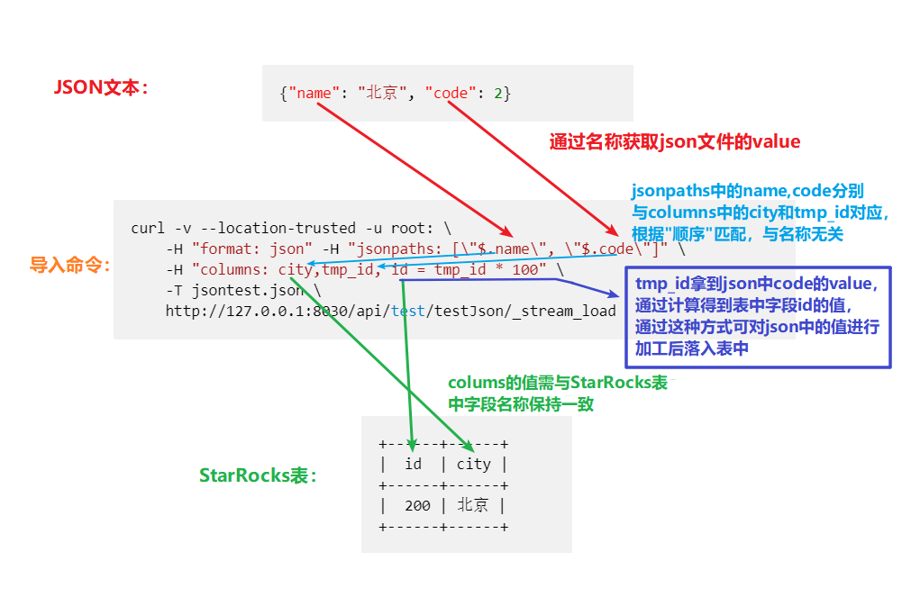

# Stream load

Stream Load 是一种同步的导入方式，用户通过发送 HTTP 请求将本地文件或数据流导入到 StarRocks 中，Stream Load 会同步执行导入并返回导入结果，用户可直接通过请求的返回值判断导入是否成功。

## 支持的数据格式

StarRocks支持从本地直接导入数据，支持 CSV 文件格式。数据量在10GB以下。

## 导入示例

### 创建导入任务

Stream Load 通过 HTTP 协议提交和传输数据。这里通过 curl 命令展示如何提交导入，用户也可以通过其他HTTP client进行操作，举例：

~~~bash
curl --location-trusted -u root -H "label:123"  -H "columns: k1, k2, v1" -T testData  http://abc.com:8030/api/test/date/_stream_load
~~~

**说明：**

* 当前支持HTTP chunked与非chunked上传两种方式，对于非chunked方式，必须要有Content-Length来标示上传内容长度，这样能够保证数据的完整性。
* 用户最好设置Expect Header字段内容100-continue，这样可以在某些出错场景下避免不必要的数据传输。

**签名参数：**

* user/passwd，Stream Load创建导入任务使用的是HTTP协议，可通过 Basic access authentication 进行签名。StarRocks 系统会根据签名来验证用户身份和导入权限。

**导入任务参数：**

Stream Load 中所有与导入任务相关的参数均设置在 Header 中。下面介绍举例语句中的部分参数的意义：

* **label** :导入任务的标签，相同标签的数据无法多次导入。用户可以通过指定Label的方式来避免一份数据重复导入的问题。当前StarRocks系统会保留最近30分钟内成功完成的任务的Label。

* **columns** ：用于指定导入文件中的列和 table 中的列的对应关系。如果源文件中的列正好对应表中的内容，那么无需指定该参数。如果源文件与表schema不对应，那么需要这个参数来配置数据转换规则。这里有两种形式的列，一种是直接对应于导入文件中的字段，可直接使用字段名表示；一种需要通过计算得出。举几个例子帮助理解：

  * 例1：表中有3列"c1, c2, c3"，源文件中的3列依次对应的是"c3,c2,c1"; 那么需要指定\-H "columns: c3, c2, c1"
  * 例2：表中有3列"c1, c2, c3" ，源文件中前3列一一对应，但是还有多余1列；那么需要指定\-H "columns: c1, c2, c3, temp"，最后1列随意指定名称用于占位即可。
  * 例3：表中有3个列“year, month, day"，源文件中只有一个时间列，为”2018-06-01 01:02:03“格式；那么可以指定 \-H "columns: col, year = year(col), month=month(col), day=day(col)"完成导入。

**返回结果：**

导入完成后，Stream Load会以Json格式返回这次导入的相关内容，示例如下：

~~~json
{
    "TxnId": 1003,
    "Label": "b6f3bc78-0d2c-45d9-9e4c-faa0a0149bee",
    "Status": "Success",
    "ExistingJobStatus": "FINISHED", // optional
    "Message": "OK",
    "NumberTotalRows": 1000000,
    "NumberLoadedRows": 999999,
    "NumberFilteredRows": 1,
    "NumberUnselectedRows": 0,
    "LoadBytes": 40888898,
    "LoadTimeMs": 2144,
    "ErrorURL": "[http://192.168.1.1:8042/api/_load_error_log?file=__shard_0/error_log_insert_stmt_db18266d4d9b4ee5-abb00ddd64bdf005_db18266d4d9b4ee5_abb00ddd64bdf005](http://192.168.1.1:8042/api/_load_error_log?file=__shard_0/error_log_insert_stmt_db18266d4d9b4ee5-abb00ddd64bdf005_db18266d4d9b4ee5_abb00ddd64bdf005)"
}
~~~

* TxnId：导入的事务ID。用户可不感知。
* Status: 导入最后的状态。
* Success：表示导入成功，数据已经可见。
* Publish Timeout：表述导入作业已经成功Commit，但是由于某种原因并不能立即可见。用户可以视作已经成功不必重试导入。
* Label Already Exists：表明该Label已经被其他作业占用，可能是导入成功，也可能是正在导入。
* 其他：此次导入失败，用户可以指定Label重试此次作业。
* Message: 导入状态的详细说明。失败时会返回具体的失败原因。
* NumberTotalRows: 从数据流中读取到的总行数。
* NumberLoadedRows: 此次导入的数据行数，只有在Success时有效。
* NumberFilteredRows: 此次导入过滤掉的行数，即数据质量不合格的行。
* NumberUnselectedRows: 此次导入，通过 where 条件被过滤掉的行数。
* LoadBytes: 此次导入的源文件数据量大小。
* LoadTimeMs: 此次导入所用的时间(ms)。
* ErrorURL: 被过滤数据的具体内容，仅保留前1000条。如果导入任务失败，可以直接用以下方式获取被过滤的数据，并进行分析，以调整导入任务。

    ~~~bash
    wget http://192.168.1.1:8042/api/_load_error_log?file=__shard_0/error_log_insert_stmt_db18266d4d9b4ee5-abb00ddd64bdf005_db18266d4d9b4ee5_abb00ddd64bdf005
    ~~~

### 取消导入

用户无法手动取消 Stream Load，Stream Load 在超时或者导入错误后会被系统自动取消。

---

## 最佳实践

可以参考 [STREAM LOAD](../sql-reference/sql-statements/data-manipulation/STREAM%20LOAD.md)

## JSON数据导入

对于文本文件存储的Json数据，我们可以采用stream load 的方式进行导入。

### Stream Load导入Json数据

样例数据：

~~~json
{ "id": 123, "city" : "beijing"},
{ "id": 456, "city" : "shanghai"},
    ...
~~~

示例：

~~~bash
curl -v --location-trusted -u root:\
    -H "format: json" -H "jsonpaths: [\"$.id\", \"$.city\"]" \
    -T example.json \
    http://FE_HOST:HTTP_PORT/api/DATABASE/TABLE/_stream_load
~~~

通过 format: json 参数可以执行导入的数据格式 jsonpaths 用来执行对应的数据导入路径

相关参数：

* jsonpaths : 选择每一列的json路径
* json\_root : 选择json开始解析的列
* strip\_outer\_array ： 裁剪最外面的 array 字段（可以见下一个样例）
* strict\_mode：导入过程中的列类型转换进行严格过滤
* columns:对应StarRocks表中的字段的名称

jsonpaths参数和columns参数还有StarRocks表中字段三者关系如下：

* jsonpaths的值名称与json文件中的key的名称一致
* columns的值的名称和StarRocks表中字段名称保持一致
* columns和jsonpaths属性的值，名称不需要保持一致(建议设置为一致方便区分)，值的顺序保持一致就可以将json文件中的value和StarRocks表中字段对应起来，如下图：

样例数据：

~~~json
{"name": "北京", "code": 2}
~~~

导入示例：

~~~bash
curl -v --location-trusted -u root: \
    -H "format: json" -H "jsonpaths: [\"$.name\", \"$.code\"]" \
    -H "columns: city,tmp_id, id = tmp_id * 100" \
    -T jsontest.json \
    http://127.0.0.1:8030/api/test/testJson/_stream_load
~~~

导入后结果

~~~plain text
+------+------+
|  id  | city |
+------+------+
|  200 | 北京 |
+------+------+
~~~

如果想先对Json中数据进行加工，然后再落入StarRocks表中，可以通过更改columns的值来实现，属性的对应关系可以参考上图中描述，示例如下:

样例数据：

~~~json
{"k1": 1, "k2": 2}
~~~

导入示例：

~~~bash
curl -v --location-trusted -u root: \
    -H "format: json" -H "jsonpaths: [\"$.k2\", \"$.k1\"]" \
    -H "columns: k2, tmp_k1, k1 = tmp_k1 * 100" \
    -T example.json \
    http://127.0.0.1:8030/api/db1/tbl1/_stream_load
~~~

这里导入过程中进行了将k1乘以100的ETL操作，并且通过Jsonpath来进行column和原始数据的对应

导入后结果

~~~plain text
+------+------+
|  k1  |  k2  |
+------+------+
|  100 |  2   |
+------+------+
~~~

 

对于缺失的列 如果列的定义是nullable，那么会补上NULL，也可以通过ifnull补充默认值。

样例数据：

~~~json
[
    {"k1": 1, "k2": "a"},
    {"k1": 2},
    {"k1": 3, "k2": "c"},
]
~~~

> 这里最外层有一对表示 json array 的中括号 `[ ]`，导入时就需要指定 `strip_outer_array = true`

导入示例-1：

~~~bash
curl -v --location-trusted -u root: \
    -H "format: json" -H "strip_outer_array: true" \
    -T example.json \
    http://127.0.0.1:8030/api/db1/tbl1/_stream_load
~~~

导入后结果：

~~~plain text
+------+------+
|  k1  | k2   |
+------+------+
|   1  | a    |
+------+------+
|   2  | NULL |
+------+------+
|   3  | c    |
+------+------+
~~~
  
导入示例-2：

~~~bash
curl -v --location-trusted -u root: \
    -H "format: json" -H "strip_outer_array: true" \
    -H "jsonpaths: [\"$.k1\", \"$.k2\"]" \
    -H "columns: k1, tmp_k2, k2 = ifnull(tmp_k2, 'x')" \
    -T example.json \
    http://127.0.0.1:8030/api/db1/tbl1/_stream_load
~~~

导入后结果：

~~~plain text
+------+------+
|  k1  |  k2  |
+------+------+
|  1   |  a   |
+------+------+
|  2   |  x   |
+------+------+
|  3   |  c   |
+------+------+
~~~

### 代码集成示例

* JAVA开发stream load，参考：[https://github.com/StarRocks/demo/MiscDemo/stream_load](https://github.com/StarRocks/demo/tree/master/MiscDemo/stream_load)
* Spark 集成stream load，参考： [01_sparkStreaming2StarRocks](https://github.com/StarRocks/demo/blob/master/docs/01_sparkStreaming2StarRocks.md)

---

## 常见问题

* 数据质量问题报错：ETL-QUALITY-UNSATISFIED; msg:quality not good enough to cancel

可参考章节导入总览/常见问题。

* Label Already Exists

可参考章节导入总览/常见问题。由于 Stream Load 是采用 HTTP 协议提交创建导入任务，一般各个语言的 HTTP Client 均会自带请求重试逻辑。StarRocks 系统在接受到第一个请求后，已经开始操作 Stream Load，但是由于没有及时向 Client 端返回结果，Client 端会发生再次重试创建请求的情况。这时候 StarRocks 系统由于已经在操作第一个请求，所以第二个请求会遇到 Label Already Exists 的情况。排查上述可能的方法：使用 Label 搜索 FE Master 的日志，看是否存在同一个 Label 出现了两次的情况。如果有就说明Client端重复提交了该请求。

建议用户根据当前请求的数据量，计算出大致的导入耗时，并根据导入超时时间改大 Client 端的请求超时时间，避免请求被 Client 端多次提交。
