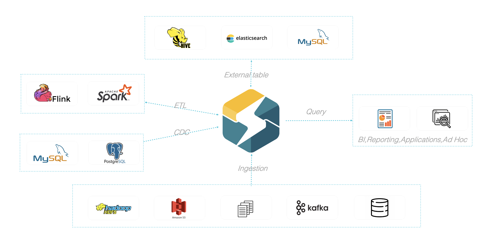

# 数据导入和查询

## 数据导入

为适配不同的数据导入需求，StarRocks 系统提供了5种不同的导入方式，以支持不同的数据源（如HDFS、Kafka、本地文件等），或者按不同的方式（异步或同步）导入数据。

### Broker Load

[Broker Load](/loading/BrokerLoad.md) 通过 Broker 进程访问并读取外部数据源，然后采用 MySQL 协议向 StarRocks 创建导入作业。

Broker Load适用于源数据在Broker进程可访问的存储系统（如HDFS）中，数据量为几十GB到上百GB。数据源有Hive等。

### Spark Load

[Spark Load](/loading/SparkLoad.md) 通过外部的 Spark 资源实现对导入数据的预处理，提高 StarRocks 大数据量的导入性能并且节省 StarRocks 集群的计算资源。

Spark Load适用于初次迁移大数据量（可到TB级别）到StarRocks的场景，且源数据在Spark可访问的存储系统（如HDFS）中。

### Stream Load

[Stream Load](/loading/StreamLoad.md)是一种同步执行的导入方式。用户通过 HTTP 协议发送请求将本地文件或数据流导入到 StarRocks中，并等待系统返回导入的结果状态，从而判断导入是否成功。

Stream Load适用于导入本地文件，或通过程序导入数据流中的数据。数据源有Flink、CSV等。

### Routine Load

[Routine Load](/loading/RoutineLoad.md)（例行导入）提供了一种自动从指定数据源进行数据导入的功能。用户通过 MySQL 协议提交例行导入作业，生成一个常驻线程，不间断的从数据源（如 Kafka）中读取数据并导入到 StarRocks 中。

### Insert Into

[Insert into](/loading/InsertInto.md)的导入方式类似 MySQL 中的 Insert 语句，StarRocks 提供 `INSERT INTO tbl SELECT ...;` 的方式从 StarRocks 的表中读取数据并导入到另一张表。或者通过 `INSERT INTO tbl VALUES(...);`插入单条数据。数据源有DataX/DTS、Kettle/Informatic、StarRocks本身。

<br/>

StarRocks数据导入整体生态图如下。


<br/>

具体导入方式详情请参考[数据导入](../loading/Loading_intro.md)。
</br>

### Stream Load导入Demo

以Stream load导入方式为例，将文件中的数据导入到[建表](/quick_start/Create_table.md)章节中创建的detailDemo表中。

* 在本地创建数据文件detailDemo_data，以逗号作为数据之间的分隔符，插入两条数据，具体内容如下：

```Plain Text
2022-03-13,1,1212,1231231231,123412341234,123452342342343324,hello,welcome,starrocks,2022-03-15 12:21:32,123.04,21.12345,123456.123456,true
2022-03-14,2,1212,1231231231,123412341234,123452342342343324,hello,welcome,starrocks,2022-03-15 12:21:32,123.04,21.12345,123456.123456,false
```

* 以 "streamDemo"为Label，使用本地文件detailDemo_data导入detailDemo表。
利用curl命令封装HTTP请求，完成数据的导入：

```bash
curl --location-trusted -u root: -T detailDemo_data -H "label: streamDemo" \
-H "column_separator:," \
http://127.0.0.1:8030/api/example_db/detailDemo_stream_load
```

> 注意：这里root是fe的用户名，默认密码为空，使用用户有密码时需在冒号后面补充密码；http中ip为fe节点ip，端口8030是fe.conf中配置的http port。

<br/>

## 查询

StarRocks兼容Mysql协议，查询语句基本符合SQL92标准。

### 简单查询

示例:查询表中全部数据

```Plain SQL
select * from detailDemo;
```

### order by查询

示例:查询结果以mache_verson字段降序排列

```Plain SQL
select * from detailDemo order by mache_verson desc;
```

StarRocks支持多种select用法，包括：[Join](/sql-reference/sql-statements/data-manipulation/SELECT.md#%E8%BF%9E%E6%8E%A5join)，[子查询](/sql-reference/sql-statements/data-manipulation/SELECT.md#子查询)，[With子表](/sql-reference/sql-statements/data-manipulation/SELECT.md#with%E5%AD%90%E5%8F%A5)等，详见[查询章节](/sql-reference/sql-statements/data-manipulation/SELECT.md)。


## 建模优化

### 函数支持

StarRocks中支持多种函数，包括：[日期函数](/sql-reference/sql-functions/date-time-functions/)，[地理位置函数](/sql-reference/sql-functions/spatial-functions)，[字符串函数](/sql-reference/sql-functions/string-functions/)，[聚合函数](/sql-reference/sql-functions/aggregate-functions/)，[Bitmap函数](/sql-reference/sql-functions/bitmap-functions/)，[数组函数](/sql-reference/sql-functions/array-functions/)，[cast函数](/sql-reference/sql-functions/cast.md)，[hash函数](/sql-reference/sql-functions/hash-functions/)，[加密函数](/sql-reference/sql-functions/encryption-functions/)，[开窗函数等](/using_starrocks/Window_function.md)等。


### 视图，物化视图

StarRocks支持创建[逻辑视图](/sql-reference/sql-statements/data-definition/CREATE%20VIEW.md#description)和[物化视图](/using_starrocks/Materialized_view.md#物化视图)。具体应用及原理详见对应章节。


### 外部表

StarRocks支持多种外部表：[MySQL外部表](/using_starrocks/External_table.md#MySQL外部表)，[ElasticSearch外部表](/using_starrocks/External_table.md#ElasticSearch外部表)，[Hive外表](/using_starrocks/External_table.md#Hive外表)，[StarRocks外部表](/using_starrocks/External_table.md#StarRocks外部表)，[Apache Iceberg外表](/using_starrocks/External_table.md#apache-iceberg%E5%A4%96%E8%A1%A8)。成功创建外部表后，可通过查询外部表的方式接入其他数据源。


## 慢查询分析

### 通过调整并行度优化查询效率

您可以通过设置 Pipeline 执行引擎变量（推荐），或者设置一个 Fragment 实例的并行数量，来设置查询并行度，从而提高CPU资源利用率和查询效率。设置方式，请参见[查询并行度相关参数](/administration/Query_management.md/#查询相关的session变量)。

### 如何查看Profile分析查询瓶颈

* 通过`explain sql`命令可以查看查询计划。
* 通过 `set is_report_success = true`可以打开profile的上报。
* 社区版用户在 `http:FE\_IP:FE\_HTTP\_PORT/query` 可以看到当前的查询和Profile信息
* 企业版用户在StarRocksManager的查询页面可以看到图形化的Profille展示，点击查询链接可以在“执行时间“页面看到树状展示，可以在“执行详情“页面看到完整的Profile详细信息。如果达不到预期可以发送执行详情页面的文本到社区或者技术支持的群里寻求帮助
* Plan和Profile参考[查询分析](../administration/Query_planning.md) 和[性能优化](../administration/Profiling.md)章节
