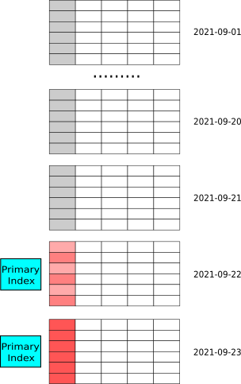

# 数据模型

建表时，您需要指定数据模型 (Data Model)，这样数据导入至数据模型时，StarRocks 会按照排序键对数据进行排序、处理和存储。本文介绍 StarRocks 支持的各种数据模型，满足您在不同业务场景下的需求。

## 基本概念

### 数据模型

StarRocks 支持四种数据模型，分别是明细模型 (Duplicate Key Model)、聚合模型 (Aggregate Key Model)、更新模型 (Unique Key Model) 和主键模型 (Primary Key Model)。这四种数据模型能够支持多种数据分析场景，例如日志分析、数据汇总分析、实时分析等。

### 排序键

数据导入至数据模型，按照建表时指定的一列或多列排序和存储，这部分用于排序的列就称为排序键。排序键通常为查询时过滤条件频繁使用的维度列，可以加速查询。明细模型中，排序键就是用于排序的列，即 `DUPLICATE KEY` 指定的列。 聚合模型中，排序键就是用于聚合的列，即 `AGGREGATE KEY` 指定的列。主键模型和更新模型中，排序键就是满足唯一性约束的列，分别由 `PRIMARY KEY` 和 `UNIQUE KEY` 指定。

StarRocks 中的排序键，相对于传统的主键，具有如下特点：

- 排序键通常为查询时过滤条件中频繁使用的维度列。

- 在明细模型中，排序键可重复，不必满足唯一性约束。在聚合模型、主键模型和更新模型中，排序键必须满足唯一性约束。

- 数据表采用聚簇存储，即表中每列的值，按照排序键进行排序并存储。

- 根据排序键生成前缀索引 (Prefix Index) 。

## 注意事项

- 在建表语句中，排序键的定义必须在其他列的定义之前。

- 在创建表时，您可以将其一个或多个列定义为排序键。排序键在建表语句中的出现次序，为数据存储时多重排序的次序。

- 前缀索引的长度限制为 36 字节。如果排序键中全部列的值的长度加起来超过 36 字节，则前缀索引仅会保存限制范围内排序键的若干前缀列。

- 如果导入的数据存在重复的主键，则数据导入至数据模型，存储在 StarRocks 时，则会按照如下方式进行处理：
  - 明细模型：表中会存在主键重复的数据行，并且与导入的数据是完全对应的。您可以召回所导入的全部历史数据。
  - 聚合模型：表中不存在主键重复的数据行，主键满足唯一性约束。导入的数据中主键重复的数据行聚合为一行，即具有相同主键的指标列，会通过聚合函数进行聚合。您可以召回导入的全部历史数据的聚合结果，但是无法召回全部历史数据。
  - 主键模型和更新模型：表中不存在主键重复的数据行，主键满足唯一性约束。最新导入的数据行，替换掉其他主键重复的数据行。这两种模型可以视为聚合模型的特殊情况，相当于在聚合模型中，为表的指标列指定聚合函数为 REPLACE，REPLACE 函数返回主键相同的一组数据中的最新数据。

## 明细模型

明细模型是默认的建表模型。

创建表时，支持定义排序键。如果查询的过滤条件包含排序键，则 StarRocks 能够快速地过滤数据，提高查询效率。明细模型适用于分析日志数据等，支持追加新数据，不支持修改历史数据。

### 适用场景

- 分析原始数据，例如原始日志、原始操作记录等。

- 查询方式灵活，不需要局限于预聚合的分析方式。

- 导入日志数据或者时序数据，主要特点是旧数据不会更新，只会追加新的数据。

### 创建表

例如，需要分析某时间范围的某一类事件的数据，则可以将事件时间（`event_time`）和事件类型（`event_type`）作为排序键。

在该业务场景下，建表语句如下：

```SQL
CREATE TABLE IF NOT EXISTS detail (
    event_time DATETIME NOT NULL COMMENT "datetime of event",
    event_type INT NOT NULL COMMENT "type of event",
    user_id INT COMMENT "id of user",
    device_code INT COMMENT "device code",
    channel INT COMMENT ""
)
DUPLICATE KEY(event_time, event_type)
DISTRIBUTED BY HASH(user_id) BUCKETS 8;
```

> 建表时必须使用 `DISTRIBUTED BY HASH` 子句指定分桶键。分桶键的更多说明，请参见[分桶](Data_distribution.md/#分桶)。

### 使用说明

- 排序键的相关说明：
  - 排序键可以通过 `DUPLICATE KEY` 显式定义。本示例中排序键为`event_time`和`event_type`。
    > 如果未指定，则 StarRocks 会为表选择默认前三列作为排序键。

  - 明细模型中的排序键可以为部分或全部维度列。

- 建表时，支持为指标列创建 BITMAP、Bloom Filter 等索引。

- 支持指标列的数据类型为 BITMAP、HLL，不支持排序键的数据类型为 BITMAP、HLL。

### 下一步

建表完成后，您可以创建多种导入作业，导入数据至表中。具体导入方式，请参见[导入概览](../loading/Loading_intro.md)。

> - 导入时，支持追加新数据，不支持修改历史数据。
> - 如果导入两行完全相同的数据，则明细模型会将这两行数据视为两行，而不是一行。

## 聚合模型

建表时，支持定义排序键和指标列，并为指标列指定聚合函数。当多条数据具有相同的排序键时，指标列会进行聚合。在分析统计和汇总数据时，聚合模型能够减少查询时所需要处理的数据，提升查询效率。

### 适用场景

适用于分析统计和汇总数据。比如:

- 通过分析网站或 APP 的访问流量，统计用户的访问总时长、访问总次数。

- 广告厂商为广告主提供的广告点击总量、展示总量、消费统计等。

- 通过分析电商的全年交易数据，获得指定季度或者月份中，各类消费人群的爆款商品。

在这些场景中，数据查询和导入，具有以下特点：

- 多为汇总类查询，比如 SUM、COUNT、MAX 等类型的查询。

- 不需要查询原始的明细数据。

- 旧数据更新不频繁，只会追加新的数据。

### 原理

从数据导入至数据查询阶段，聚合模型内部同一排序键的数据会多次聚合，聚合的具体时机和机制如下：

1. 数据导入阶段：数据按批次导入至聚合模型时，每一个批次的数据形成一个版本，在一个版本中，同一排序键的数据会进行一次聚合。

1. 后台文件合并阶段 (Compaction) ：数据分批次多次导入至聚合模型中，会生成多个版本的文件，多个版本的文件定期合并成一个大版本文件时，同一排序键的数据会进行一次聚合。

1. 查询阶段：所有版本中同一排序键的数据进行聚合，然后返回查询结果。

因此，聚合模型中数据多次聚合，能够减少查询时所需要的处理的数据量，进而提升查询的效率。

例如，导入如下数据至聚合模型中：

| Date       | Country | PV   |
| ---------- | ------- | ---- |
| 2020.05.01 | CHN     | 1    |
| 2020.05.01 | CHN     | 2    |
| 2020.05.01 | USA     | 3    |
| 2020.05.01 | USA     | 4    |

在聚合模型中，以上四条数据会聚合为两条数据。这样在后续查询处理的时候，处理的数据量就会显著降低。

| Date       | Country | PV   |
| ---------- | ------- | ---- |
| 2020.05.01 | CHN     | 3    |
| 2020.05.01 | USA     | 7    |

### 创建表

例如需要分析某一段时间内，来自不同城市的用户，访问不同网页的总次数。则可以将网页地址 `site_id`、日期 `date` 和城市代码 `city_code` 作为排序键，将访问次数 `pv` 作为指标列，并为指标列 `pv` 指定聚合函数为 SUM。

在该业务场景下，建表语句如下：

```SQL
CREATE TABLE IF NOT EXISTS example_db.aggregate_tbl (
    site_id LARGEINT NOT NULL COMMENT "id of site",
    date DATE NOT NULL COMMENT "time of event",
    city_code VARCHAR(20) COMMENT "city_code of user",
    pv BIGINT SUM DEFAULT "0" COMMENT "total page views"
)
DISTRIBUTED BY HASH(site_id) BUCKETS 8;
```

> 建表时必须使用 `DISTRIBUTED BY HASH` 子句指定分桶键。分桶键的更多说明，请参见[分桶](Data_distribution.md/#分桶)。

### 使用说明

- 排序键的相关说明：
  - 排序键可以通过 `AGGREGATE KEY` 显式定义。

    > - 如果 `AGGREGATE KEY` 未包含全部维度列（除指标列之外的列），则建表会失败。
    > - 如果不通过 `AGGREGATE KEY` 显示定义排序键，则默认除指标列之外的列均为排序键。

  - 排序键必须满足唯一性约束，必须包含全部维度列且列的值不会修改。

- 指标列：通过在列名后指定聚合函数，定义该列为指标列。一般为需要汇总统计的数据。

- 聚合函数：指标列使用的聚合函数。聚合模型支持的聚合函数，请参见 [CREATE TABLE](../sql-reference/sql-statements/data-definition/CREATE%20TABLE.md)。

- 查询时，排序键在多版聚合之前就能进行过滤，而指标列的过滤在多版本聚合之后。因此建议将频繁使用的过滤字段作为排序键，在聚合前就能过滤数据，从而提升查询性能。

- 建表时，不支持为指标列创建 BITMAP、Bloom Filter 等索引。

- 支持指标列的数据类型为 BITMAP、HLL，不支持排序键的数据类型为 BITMAP、HLL。

### 下一步

建表完成后，您可以创建多种导入作业，导入数据至表中。具体导入方式，请参见[导入概览](../loading/Loading_intro.md)。

> 导入时，仅支持全部更新，即导入任务需要指明所有列，例如示例中的 `site_id`、`date`、`city_code` 和 `pv` 四个列。

## 更新模型

建表时，支持定义主键和指标列，查询时返回主键相同的一组数据中的最新数据。相对于明细模型，更新模型简化了数据导入流程，能够更好地支撑实时和频繁更新的场景。

### 适用场景

实时和频繁更新的业务场景，例如分析电商订单。在电商场景中，订单的状态经常会发生变化，每天的订单更新量可突破上亿。

### 原理

更新模型可以视为聚合模型的特殊情况，指标列指定的聚合函数为 REPLACE，返回具有相同主键的一组数据中的最新数据。

数据分批次多次导入至更新模型，每一批次数据分配一个版本号，因此同一主键的数据可能有多个版本，查询时返回版本最新（即版本号最大）的数据。相对于明细模型，更新模型通过简化导入流程，能够更好地支持实时和频繁更新。

例如下表中，`ID` 是主键，`value` 是指标列，`_version` 是 StarRocks 内部的版本号。其中，`ID` 为 1 的数据有两个导入批次，版本号分别为 `1` 和 `2`；`ID` 为 `2` 的数据有三个导入批次，版本号分别为 `3`、`4`、`5`。

| ID   | value | _version |
| ---- | ----- | -------- |
| 1    | 100   | 1        |
| 1    | 101   | 2        |
| 2    | 100   | 3        |
| 2    | 101   | 4        |
| 2    | 102   | 5        |

查询 `ID` 为 `1` 的数据时，仅会返回最新版本 `2` 的数据，而查询 `ID` 为 `2` 的数据时，仅会返回最新版本 `5` 的数据，最终查询结果如下：

| ID   | value |
| ---- | ----- |
| 1    | 101   |
| 2    | 102   |

### 创建表

在电商订单分析场景中，经常按照日期对订单状态进行统计分析，则可以将经常使用的过滤字段订单创建时间 `create_time`、订单编号 `order_id` 作为主键，其余列订单状态 `order_state` 和订单总价 `total_price` 作为指标列。这样既能够满足实时更新订单状态的需求，又能够在查询中进行快速过滤。

在该业务场景下，建表语句如下：

```SQL
CREATE TABLE IF NOT EXISTS orders (
    create_time DATE NOT NULL COMMENT "create time of an order",
    order_id BIGINT NOT NULL COMMENT "id of an order",
    order_state INT COMMENT "state of an order",
    total_price BIGINT COMMENT "price of an order"
)
UNIQUE KEY(create_time, order_id)
DISTRIBUTED BY HASH(order_id) BUCKETS 8;
```

> 建表时必须使用 `DISTRIBUTED BY HASH` 子句指定分桶键。分桶键的更多说明，请参见[分桶](Data_distribution.md/#分桶)。

### 使用说明

- 主键的相关说明：
  - 主键通过 `UNIQUE KEY` 定义。
  - 主键必须满足唯一性约束，且列的值不会修改。
  - 设置合理的主键。
    - 查询时，主键在聚合之前就能进行过滤，而指标列的过滤通常在多版本聚合之后，因此建议将频繁使用的过滤字段作为主键，在聚合前就能过滤数据，从而提升查询性能。
    - 聚合过程中会比较所有主键，因此需要避免设置过多的主键，以免降低查询性能。如果某个列只是偶尔会作为查询中的过滤条件，则不建议放在主键中。

- 建表时，不支持为指标列创建 BITMAP、Bloom Filter 等索引。

- 支持指标列的数据类型为 BITMAP、HLL，不支持主键的数据类型为 BITMAP、HLL。

### 下一步

建表完成后，您可以创建多种导入作业，导入数据至表中。具体导入方式，请参见[导入概览](../loading/Loading_intro.md)。

> - 导入数据时，仅支持全部更新，即导入任务需要指明所有列，例如示例中的 `create_time`、`order_id`、`order_state` 和 `total_price` 四个列。
>
> - 在设计导入频率时，建议以满足业务对实时性的要求为准。查询更新模型的数据时，需要聚合多版本的数据，当版本过多时会导致查询性能降低。所以导入数据至更新模型时，应该适当降低导入频率，从而提升查询性能。建议在设计导入频率时以满足业务对实时性的要求为准。如果业务对实时性的要求是分钟级别，那么每分钟导入一次更新数据即可，不需要秒级导入。

## 主键模型

StarRocks 1.19 版本推出了主键模型 (Primary Key Model) 。建表时，支持定义主键和指标列，查询时返回主键相同的一组数据中的最新数据。相对于更新模型，主键模型在查询时不需要执行聚合操作，并且支持谓词和索引下推，能够在支持**实时和频繁更新**等场景的同时，提供高效查询。

### 适用场景

- 主键模型适用于实时和频繁更新的场景，例如：
  - **实时对接事务型数据至 StarRocks**。事务型数据库中，除了插入数据外，一般还会涉及较多更新和删除数据的操作，因此事务型数据库的数据同步至 StarRocks 时，建议使用主键模型。[通过 Flink-CDC 等工具直接对接 TP 的 Binlog](../loading/Flink_cdc_load.md)，实时同步增删改的数据至主键模型，可以简化数据同步流程，并且相对于读时合并 (Merge-On-Read) 策略的更新模型，查询性能能够提升 3~10 倍。
  - **利用部分列更新轻松实现多流 JOIN**。在用户画像等分析场景中，一般会采用大宽表方式来提升多维分析的性能，同时简化数据分析师的使用模型。而这种场景中的上游数据，往往可能来自于多个不同业务（比如来自购物消费业务、快递业务、银行业务等）或系统（比如计算用户不同标签属性的机器学习系统），主键模型的部分列更新功能就很好地满足这种需求，不同业务直接各自按需更新与业务相关的列即可，并且继续享受主键模型的实时同步增删改数据及高效的查询性能。

- 主键模型适用于主键占用空间相对可控的场景。这是由于 StarRocks 存储引擎会为主键模型的主键创建索引，并导入时将主键索引加载至内存中，所以相对于其他模型，主键模型对内存的要求比较高。**目前主键模型中，主键编码后，占用内存空间上限为 127 字节**。

- 如下两个场景中，主键占用空间相对可控：

  - **数据有冷热特征**，即最近几天的热数据才经常被修改，老的冷数据很少被修改。例如，MySQL订单表实时同步到 StarRocks 中提供分析查询。其中，数据按天分区，对订单的修改集中在最近几天新创建的订单，老的订单完成后就不再更新，因此导入时其主键索引就不会加载，也就不会占用内存，内存中仅会加载最近几天的索引。<br>
    
    > 如图所示，数据按天分区，最新两个分区的数据更新比较频繁。
  - **大宽表**（数百到数千列）。主键只占整个数据的很小一部分，其内存开销比较低。比如用户状态和画像表，虽然列非常多，但总的用户数不大（千万至亿级别），主键索引内存占用相对可控。
    
    > 如图所示，大宽表中排序键只占一小部分，且数据行数不多。

### 原理

主键模型是由 StarRocks 全新设计开发的存储引擎支撑。相比于更新模型，主键模型的元数据组织、读取、写入方式完全不同，不需要执行聚合操作，并且支持谓词和索引下推，极大地提高了查询性能。

更新模型整体上采用了读时合并的策略。虽然写入时处理简单高效，但是查询时需要在线聚合多版本。并且由于 Merge 算子的存在，谓词和索引无法下推，严重影响了查询性能。

而主键模型采用了 Delete+Insert 的策略，保证同一个主键下仅存在一条记录，这样就完全避免了 Merge 操作。具体实现方式如下：

- StarRocks 收到对某记录的更新操作时，会通过主键索引找到该条记录的位置，并对其标记为删除，再插入一条新的记录。相当于把 Update 改写为 Delete+Insert。

- StarRocks 收到对某记录的删除操作时，会通过主键索引找到该条记录的位置，对其标记为删除。

这样，查询时不需要执行聚合操作，不影响谓词和索引的下推，保证了查询的高效执行。

### 创建表

- 例如，需要按天实时分析订单，则可以将时间 `dt`、订单编号 `order_id` 作为主键，其余列为指标列。建表语句如下：

```SQL
create table orders (
    dt date NOT NULL,
    order_id bigint NOT NULL,
    user_id int NOT NULL,
    merchant_id int NOT NULL,
    good_id int NOT NULL,
    good_name string NOT NULL,
    price int NOT NULL,
    cnt int NOT NULL,
    revenue int NOT NULL,
    state tinyint NOT NULL
) PRIMARY KEY (dt, order_id)
PARTITION BY RANGE(`dt`) (
    PARTITION p20210820 VALUES [('2021-08-20'), ('2021-08-21')),
    PARTITION p20210821 VALUES [('2021-08-21'), ('2021-08-22')),
    ...
    PARTITION p20210929 VALUES [('2021-09-29'), ('2021-09-30')),
    PARTITION p20210930 VALUES [('2021-09-30'), ('2021-10-01'))
) DISTRIBUTED BY HASH(order_id) BUCKETS 4
PROPERTIES("replication_num" = "3",
"enable_persistent_index" = "true");
```

> 建表时必须使用 `DISTRIBUTED BY HASH` 子句指定分桶键。分桶键的更多说明，请参见[分桶](Data_distribution.md/#分桶)。

- 例如，需要实时分析用户情况，则可以将用户 ID `user_id` 作为主键，其余为指标列。建表语句如下：

```SQL
create table users (
    user_id bigint NOT NULL,
    name string NOT NULL,
    email string NULL,
    address string NULL,
    age tinyint NULL,
    sex tinyint NULL,
    last_active datetime,
    property0 tinyint NOT NULL,
    property1 tinyint NOT NULL,
    property2 tinyint NOT NULL,
    property3 tinyint NOT NULL,
    ....
) PRIMARY KEY (user_id)
DISTRIBUTED BY HASH(user_id) BUCKETS 4
PROPERTIES("replication_num" = "3",
"enable_persistent_index" = "true");
```

> 建表时必须使用 `DISTRIBUTED BY HASH` 子句指定分桶键。分桶键的更多说明，请参见[分桶](Data_distribution.md/#分桶)。

### 使用说明

- 主键相关的说明：
  - 主键通过 `PRIMARY KEY` 定义。
  - 主键必须满足唯一性约束，且列的值不会修改。本示例中主键为 `dt`、`order_id`。
  - 支持主键的数据类型为 BOOLEAN、TINYINT、SMALLINT、INT、BIGINT、LARGEINT、STRING、VARCHAR、DATE、DATETIME，且不允许为 NULL。
  - 分区列和分桶列必须在主键中。
  - 合理设置主键的列数和长度，以节约内存。建议主键为占用内存空间较少的数据类型，例如 INT、BIGINT 等，暂时不建议为 VARCHAR。
  - 在建表前，建议根据主键的数据类型和表的行数来预估主键索引占用内存空间，以避免出现内存溢出。以下示例说明主键索引占用内存空间的计算方式：
    - 假设存在主键模型，排序键为`dt`、`id`，数据类型为 DATE（4 个字节）、BIGINT（8 个字节）。则排序键占 12 个字节。
    - 假设该表的热数据有 1000 万行，存储为三个副本。
    - 则内存占用的计算方式：`(12 + 9(每行固定开销) ) * 1000W * 3 * 1.5（哈希表平均额外开销) = 945 M`
- `enable_persistent_index`：是否持久化主键索引，同时使用磁盘和内存存储主键索引，避免主键索引占用过大内存空间。取值为 `true` 或者 `false`。通常情况下，持久化主键索引后，主键索引所占内存为之前的 1/10。

   > - 主键必须为定长的数据类型，不支持为可变长的数据类型（例如 VARCHAR）。
   > - 如果磁盘为固态硬盘 SSD，则建议设置为 `true`。
   > - 自 2.3.0 版本起，StarRocks 支持配置该参数。

- 创建表时，支持为指标列创建 BITMAP、Bloom Filter 等索引。

- 自 2.3 版本开始，支持指标列的数据类型为 BITMAP、HLL，不支持主键的数据类型为 BITMAP、HLL。

- 主键模型目前不支持物化视图。

- 暂不支持使用 ALTER TABLE 修改列类型。 ALTER TABLE 的相关语法说明和示例，请参见 [ALTER TABLE](../sql-reference/sql-statements/data-definition/ALTER%20TABLE.md)。

### 下一步

建表完成后，您可以创建多种导入作业，导入数据至表中。具体导入方式，请参见[主键模型导入](../loading/PrimaryKeyLoad.md)。
